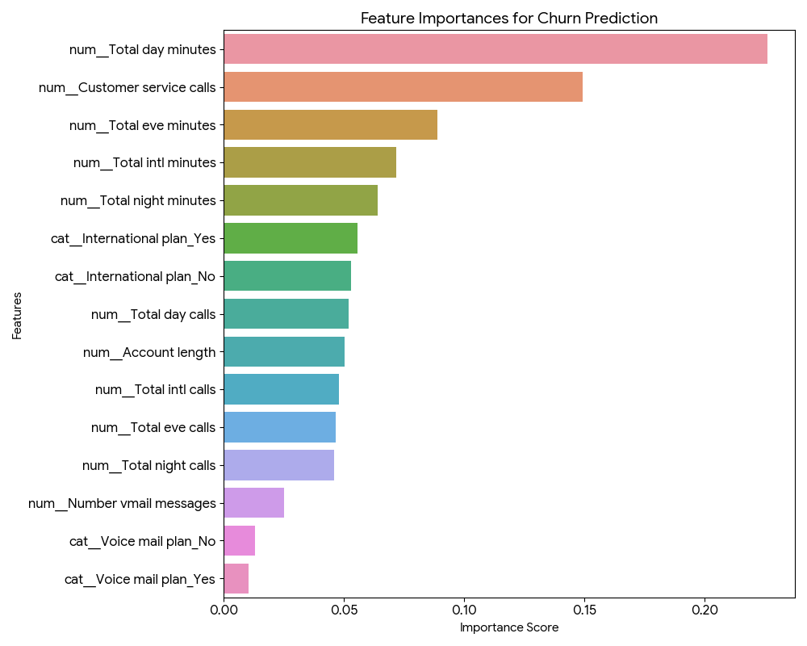
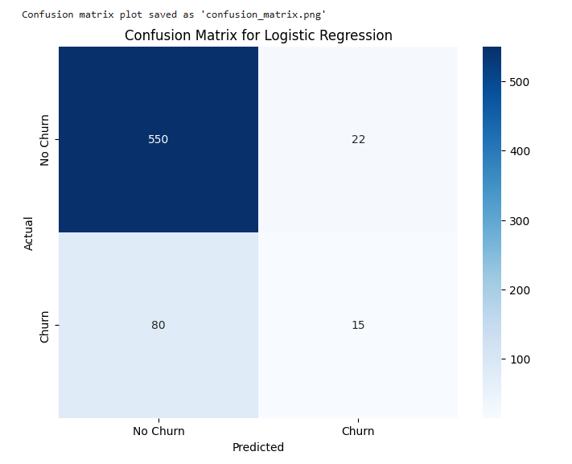
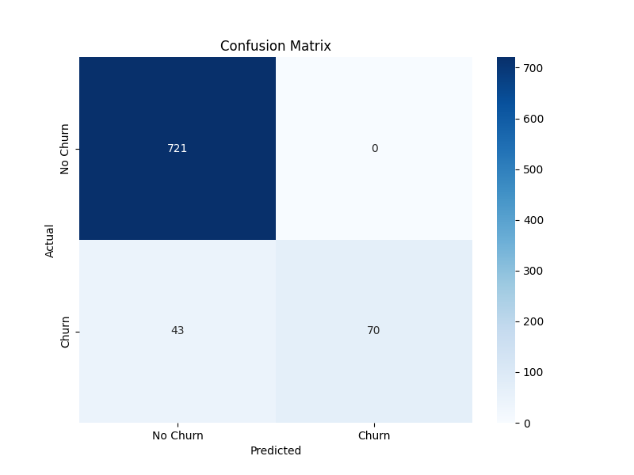

# Customer Churn Prediction - Telecom Sector

## 📌 Overview
Customer churn is a major challenge in the telecom industry. This project predicts customer churn using demographic and usage data.

## 🚀 Tech Stack
- Python
- Pandas, NumPy, Matplotlib, Seaborn
- Scikit-learn (Logistic Regression, Random Forest)

## 📊 Model Results

- **Best Model:** Random Forest Classifier
- **Accuracy:** 94% (Test Data)
- **Precision / Recall / F1-score:** See classification report in notebook
  - **Feature Importance:**
  
  
  
- **Confusion Matrix From Logistic Regressor:**
  
  

- **Confusion Matrix From Random Forest:**
  
  
  

---

## 📂 Structure
- `data/` → Datasets
- `notebooks/` → Jupyter notebooks

## 📜 License
MIT License © 2025 Rochith Phutane
